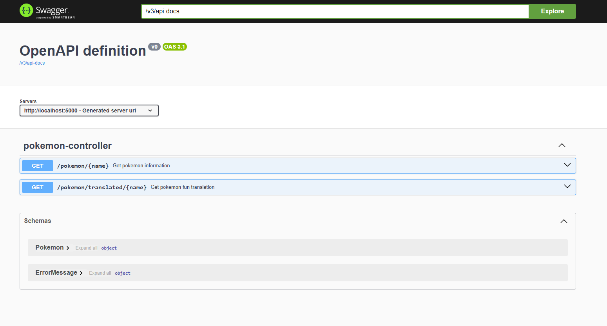

## Description

A simple Pokédex application that allows you to retrieve Pokémon information. 
It also offers a fun translation feature.

###### Tecnincal Notes
This is a Spring Boot 3 Maven application. A Swagger UI is provided for the API documentation.

### System Requirements

This application requires the following to be installed on your system::
- OpenJDK 21
- maven 3.9.9
- docker

Installation guides can be found:
- [JDK 21](https://openjdk.org/install/)
- [Maven](https://maven.apache.org/install.html)
- [Docker](https://docs.docker.com/engine/install/)

Note: I generally prefer to install JDKs and Maven by downloading the binaries and setting the home path to the directory location."

### Build

#### Jar build

Using JDK and maven:

```shell
mvn clean install
mvn clean package
```

#### Docker
Using docker:

```shell
docker build -t pokedex:1.0.0 .

```

### How to run:

To run the application as a JAR, first build the JAR file. Once built, execute the following command:
```shell
java -jar .\target\pokedex-1.0.0.jar --spring.profiles.active=dev
```
This command will start the application in the development environment, where the appropriate API configurations are set.<br/>

<b>Note</b>: For <b>production</b>, do not use the `--spring.profiles.active` argument. Instead, pass the env as arguments to the jar directly


To run the application in a Docker container, first build the image and execute command:

```shell
docker run \
    -p 5000:5000 \
    -e POKEMON_HOST=https://pokeapi.co \
    -e TRANSLATION_HOST=https://api.funtranslations.com \
     pokedex:1.0.0
```

You can also use the Docker Compose file located in the `/docker` directory to run the application. <br />
This simplifies the process of running multiple containers or setting up environment variables.

```shell
cd docker
docker compose up
```

n case the image has not been built yet, Docker Compose will build it automatically


### API Documentation

Swagger documentation is provided for the API. <br/>
Once the application has started, you can access the documentation by navigating to:
> http://localhost:5000/swagger-ui/index.html

**Note**: The default port is 5000. However, the port can be dynamically set through configuration
<br/>




### Tests

This project includes a comprehensive test suite organized as follows

- <b>web/integration</b>: Contains integration tests that utilize a test controller as mock real server.
- <b>web/*Test.java</b>: Contains unit tests for individual components.

The test suite can be run with the following command:

```shell
mvn clean verify
```

